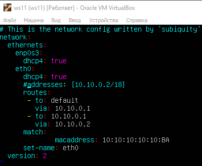

# Сети в Linux

Настройка сетей в Linux на виртуальных машинах.

## Part 1. Инструмент **ipcalc**

- Для установки утилиты **ipcalc** введем команду `sudo apt install ipcalc`. 

- Поднимаем виртуальную машину ws1.

#### 1.1. Сети и маски
##### Определить:
##### 1) адрес сети *192.167.38.54/13*


- адрес сети *192.167.38.54/13* - 192.160.0.0

##### 2) перевод маски *255.255.255.0* в префиксную и двоичную запись, */15* в обычную и двоичную, *11111111.11111111.11111111.11110000* в обычную и префиксную


- префиксная запись маски 255.255.255.0 - /24
- двоичная запись - 11111111.11111111.11111111.00000000


- обычная запись маски /15 - 255.254.0.0
- двоичная запись - 11111111.11111110.00000000.00000000

- посчитаем количество единичных бит в двоичной записи маски 11111111.11111111.11111111.11110000 - 28


- обычная запись маски 11111111.11111111.11111111.11110000 - 255.255.255.240
- префиксная запись - /28

##### 3) минимальный и максимальный хост в сети *12.167.38.4* при масках: */8*, *11111111.11111111.00000000.00000000*, *255.255.254.0* и */4*


- минимальный хост при маске /8 - 12.0.0.1
- максимальный хост - 12.255.255.254


- минимальный хост при маске 11111111.11111111.00000000.00000000 - 12.167.0.1
- максимальный хост - 12.167.255.254


- минимальный хост при маске 255.255.254.0 - 12.167.38.1
- максимальный хост - 12.167.39.254


- минимальный хост при маске /4 - 0.0.0.1
- максимальный хост - 15.255.255.255

#### 1.2. localhost
##### Определить, можно ли обратиться к приложению, работающему на localhost, со следующими IP: *194.34.23.100*, *127.0.0.2*, *127.1.0.1*, *128.0.0.1*

- Диапазон адресов, зарезервированных для localhost: \
127.0.0.0 — 127.255.255.255. \
Таким образом, мы можем обратиться к приложениям работающим на IP 127.0.0.2 и 127.1.0.1. К оставшимся двум адресам обратиться нельзя.

- На скриншотах возможность обратиться по адресу отмечена словом `Loopback` в строке Hosts/Net:


#### 1.3. Диапазоны и сегменты сетей
##### Определить:
##### 1) какие из перечисленных IP можно использовать в качестве публичного, а какие только в качестве частных: *10.0.0.45*, *134.43.0.2*, *192.168.4.2*, *172.20.250.4*, *172.0.2.1*, *192.172.0.1*, *172.68.0.2*, *172.16.255.255*, *10.10.10.10*, *192.169.168.1*

- публичные IP:\
134.43.0.2\
172.0.2.1\
192.172.0.1\
172.68.02\
192.169.168.1

- частные IP:\
10.0.0.45\
192.168.4.2\
172.20.250.4\
172.16.255.255\
10.10.10.10

- На скриншотах частные адреса помечены, как `Private Internet` в строке Hosts/Net:


##### 2) какие из перечисленных IP адресов шлюза возможны у сети *10.10.0.0/18*: *10.0.0.1*, *10.10.0.2*, *10.10.10.10*, *10.10.100.1*, *10.10.1.255*


- возможные адреса: \
10.10.0.2,\
10.10.10.10,\
10.10.1.255.

## Part 2. Статическая маршрутизация между двумя машинами

- Поднимаем две виртуальные машины: ws1 и ws2.

- С помощью команды `ip a` смотрим существующие сетевые интерфейсы:


##### Описать сетевой интерфейс, соответствующий внутренней сети, на обеих машинах и задать следующие адреса и маски: ws1 - *192.168.100.10*, маска */16*, ws2 - *172.24.116.8*, маска */12*

- Внутренней сети соответствует интерфейс enp0s8.

- Содержание изменённого файла *etc/netplan/00-installer-config.yaml* для каждой машины:


- Выполняем команду `netplan apply` для перезапуска сервиса сети:


#### 2.1. Добавление статического маршрута вручную
- Добавляем статический маршрут от одной машины до другой и обратно при помощи команды вида `ip r add` и пингуем соединение между машинами:


#### 2.2. Добавление статического маршрута с сохранением

- Перезапускаем машины командой `reboot`.

- Добавляем статический маршрут от одной машины до другой с помощью файла *etc/netplan/00-installer-config.yaml*:


- Пингуем соединение между машинами:


## Part 3. Утилита **iperf3**

- для установки утилиты **iperf3** введем команду `sudo apt install iperf3`. 

*В данном задании используются виртуальные машины ws1 и ws2 из Части 2*

#### 3.1. Скорость соединения

- 8 Mbps = 1 MB/s
- 100 MB/s = 800000 Kbps
- 1 Gbps = 1000 Mbps

#### 3.2. Утилита **iperf3**

- Измеряем скорость соединения между ws1 и ws2:


ws1 выступает в роли сервера


ws2 выступает в роли клиента

## Part 4. Сетевой экран

*В данном задании используются виртуальные машины ws1 и ws2 из Части 2*

#### 4.1. Утилита **iptables**

- Создаем файл */etc/firewall.sh*, имитирующий фаерволл, на ws1 и ws2:
```shell
#!/bin/sh

# Удаление всех правил в таблице "filter" (по-умолчанию).
iptables –F
iptables -X
```
##### Нужно добавить в файл подряд следующие правила:
##### 1) на ws1 применить стратегию когда в начале пишется запрещающее правило, а в конце пишется разрешающее правило (это касается пунктов 4 и 5)
##### 2) на ws2 применить стратегию когда в начале пишется разрешающее правило, а в конце пишется запрещающее правило (это касается пунктов 4 и 5)
##### 3) открыть на машинах доступ для порта 22 (ssh) и порта 80 (http)
##### 4) запретить *echo reply* (машина не должна "пинговаться”, т.е. должна быть блокировка на OUTPUT)
##### 5) разрешить *echo reply* (машина должна "пинговаться")
- Содержание файла */etc/firewall* для каждой машины:


- Запускаем файлы на обеих машинах командами `chmod +x /etc/firewall.sh` и `/etc/firewall.sh`:


- Разница между стратегиями, применёнными в первом и втором файлах:

Для ws1 сначала правило запрещает отправлять эхо-ответ на ping, а в конце разрешает. Так как правила в цепочке выполняются по порядку, ws1 не отвечает на ping. \
Для ws2 сначала првило разрешает отправлять эхо-ответ на ping, а в конце запрещает. ws2 отвечает на ping.

#### 4.2. Утилита **nmap**

- для установки утилиты **nmap** введем команду `sudo snap install nmap`. 

- Командой **ping** найдем машину, которая не "пингуется", после чего утилитой **nmap** посмотрим, что хост машины запущен:


ws2 пингуется


ws1 не пингуется, утилита `nmap` показывает, что хост ws1 запущен: `Host is up`.

## Part 5. Статическая маршрутизация сети

Сеть: \


- Поднимаем пять виртуальных машин (3 рабочие станции (ws11, ws21, ws22) и 2 роутера (r1, r2)).

#### 5.1. Настройка адресов машин
- Настроим конфигурации машин в *etc/netplan/00-installer-config.yaml* согласно сети на рисунке:


- Перезапускаем сервис сети. \
Командой `ip -4 a` проверяем, что адрес машины задан верно. \
Пропинговать ws22 с ws21. Аналогично пропинговать r1 с ws11.

Проверка адреса машины ws11 и пинг машины r1:


Проверка адреса машины ws21 и пинг машины ws22:


Проверка адреса машины ws22:


Проверка адреса машины r1:


Проверка адреса машины r2:


#### 5.2. Включение переадресации IP-адресов.
- Для включения переадресации IP выполняем команду на роутерах:
`sysctl -w net.ipv4.ip_forward=1` 
(*При таком подходе переадресация не будет работать после перезагрузки системы.*):


- Открываем файл */etc/sysctl.conf* и добавляем в него следующую строку:
`net.ipv4.ip_forward = 1`
(*При использовании этого подхода, IP-переадресация включена на постоянной основе.*).
- Содержание изменённого файла */etc/sysctl.conf*:


#### 5.3. Установка маршрута по-умолчанию
- Настроим маршрут по-умолчанию (шлюз) для рабочих станций. Для этого добавим `default` перед IP роутера в файле конфигураций.
- Содержаниее файла *etc/netplan/00-installer-config.yaml*:


- Вызовем `ip r` и видим, что добавился маршрут в таблицу маршрутизации:


- Пингуем с ws11 роутер r2:


- Смотрим на r2, что пинг доходит. Для этого используем команду:
`tcpdump -tn -i eth0`:


#### 5.4. Добавление статических маршрутов
- Добавим в роутеры r1 и r2 статические маршруты в файле конфигураций. 
- Содержание изменённого файла *etc/netplan/00-installer-config.yaml* для каждого роутера:


- Вызовем `ip r` и видим таблицы с маршрутами на обоих роутерах: 


- Запускаем команды `ip r list 10.10.0.0/[маска сети]` и `ip r list 0.0.0.0/0` на ws11:


- Объяснить, почему для адреса 10.10.0.0/\[маска сети\] был выбран маршрут, отличный от 0.0.0.0/0, хотя он попадает под маршрут по-умолчанию.

Первый маршрут отличается от второго, т.к. адрес 10.10.0.0  является адресом сети и доступен без роутера, а во втором случае запрос идет на роутер.

#### 5.5. Построение списка маршрутизаторов
- Запустим на r1 команду дампа:
`tcpdump -tnv -i eth0`


- Установим утилиту **traceroute** при помощи команды `sudo apt install traceroute`. \
При помощи утилиты **traceroute** построим список маршрутизаторов на пути от ws11 до ws21:


- Опираясь на вывод, полученный из дампа на r1, объяснить принцип работы построения пути при помощи **traceroute**.

Вся информация в сети передается в виде пакетов. Поток данных разбивается специальным программным обеспечением на небольшие пакеты и передается через сеть на целевой узел, а там собирается обратно.\
Каждый пакет проходит на своем пути определенное количество узлов, пока достигнет своей цели. Причем, каждый пакет имеет свое время жизни. Это количество узлов, которые может пройти пакет перед тем, как он будет уничтожен. Этот параметр записывается в заголовке TTL. Каждый маршрутизатор, через который будет проходить пакет, уменьшает его на единицу. При TTL=0 пакет уничтожается, а отправителю отсылается сообщение Time Exceeded.\
Команда `traceroute` linux использует UDP пакеты. Она отправляет пакет с TTL=1 и смотрит адрес ответившего узла, дальше TTL=2, TTL=3 и так пока не достигнет цели. Каждый раз отправляется по три пакета и для каждого из них измеряется время прохождения. Когда утилита `traceroute` получает сообщение от целевого узла о том, что порт недоступен трассировка считается завершенной.

#### 5.6. Использование протокола **ICMP** при маршрутизации
- Запустим на r1 перехват сетевого трафика, проходящего через eth0 с помощью команды:
`tcpdump -n -i eth0 icmp`:


- Пропингуем с ws11 несуществующий IP (например, *10.30.0.111*) с помощью команды:
`ping -c 1 10.30.0.111`:


## Part 6. Динамическая настройка IP с помощью **DHCP**

*В данном задании используются виртуальные машины из Части 5*

- Для r2 настроить в файле */etc/dhcp/dhcpd.conf* конфигурацию службы **DHCP**:
##### 1) указать адрес маршрутизатора по-умолчанию, DNS-сервер и адрес внутренней сети.
##### 2) в файле *resolv.conf* прописать `nameserver 8.8.8.8.`
- Содержаниее изменённых файлов:


файл */etc/dhcp/dhcpd.conf* для r2


файл *resolv.conf* для r2

- Перезагружаем службу **DHCP** командой `systemctl restart isc-dhcp-server`:


- В файле *etc/netplan/00-installer-config.yaml* для ws21 меняем параметр `dhcp` c `no` на `true` и закомментируем статический адрес:


- Машину ws21 перезагружаем при помощи `reboot` и через `ip a` видим, что она получила динамический адрес от DHCP-сервера:


- Пингуем ws22 c ws21:


- Указываем MAC адрес у ws11, для этого в *etc/netplan/00-installer-config.yaml* добавим строки: \
`macaddress: 10:10:10:10:10:BA`, \
`dhcp4: true`
- Содержание изменённого файла *etc/netplan/00-installer-config.yaml*:



- Для r1 настраиваем аналогично r2, но выдачу адресов делаем с жесткой привязкой к MAC-адресу (ws11). 

- файл */etc/dhcp/dhcpd.conf* для r1:


- файл *resolv.conf* для r1:


- Перезагружаем службу **DHCP** командой `systemctl restart isc-dhcp-server`:


- Выключаем машину ws11 и меняем МАС-адрес машины в настройках сети:


- Запускаем машину ws11 и через `ip a`
видим, что машина получила динамический адрес от DHCP-сервера:


- Запросим с ws21 обновление ip адреса:


ip адрес машины ws21 до обновления


ip адрес машины ws21 после обновления

Для освобождения занятого IP адреса использовалась команда `dhclient -r eth0`.
Для получения нового адреса исползовалась команда `sudo dhclient eth0`.

## Part 7. **NAT**

*В данном задании используются виртуальные машины из Части 5*

- Для установки службы **Apache2** введем команду `sudo apt install apache2`. 

- В файле */etc/apache2/ports.conf* на ws22 и r1 изменим строку `Listen 80` на `Listen 0.0.0.0:80`, то есть сделаем сервер Apache2 общедоступным.

- Содержание изменённого файла:


- Запускаем веб-сервер Apache командой `service apache2 start` на ws22 и r1:


- Добавим в фаервол, созданный по аналогии с фаерволом из Части 4, на r2 следующие правила:
##### 1) удаление правил в таблице filter - `iptables -F`
##### 2) удаление правил в таблице "NAT" - `iptables -F -t nat`
##### 3) отбрасывать все маршрутизируемые пакеты - `iptables --policy FORWARD DROP`


- Запускаем файл:


- Проверяем соединение между ws22 и r1 командой `ping`
(*При запуске файла с этими правилами, ws22 не должна "пинговаться" с r1*)


- Добавим в файл ещё одно правило:
##### 4) разрешить маршрутизацию всех пакетов протокола **ICMP**


- Запускаем файл:


- Проверяем соединение между ws22 и r1 командой `ping`
(*При запуске файла с этими правилами, ws22 должна "пинговаться" с r1*)


- Добавим в файл ещё два правила:
##### 5) включить **SNAT**, а именно маскирование всех локальных ip из локальной сети, находящейся за r2 (по обозначениям из Части 5 - сеть 10.20.0.0)
##### 6) включить **DNAT** на 8080 порт машины r2 и добавить к веб-серверу Apache, запущенному на ws22, доступ извне сети


- Запускаем файл:


- Отключаем сетевой интерфейс **NAT** 

- Проверяем соединение по TCP для **SNAT**, для этого с ws22 подключаемся к серверу Apache на r1 командой
`telnet`:


- Проверяем соединение по TCP для **DNAT**, для этого с r1 подключаемся к серверу Apache на ws22 командой `telnet`:


## Part 8. Дополнительно. Знакомство с **SSH Tunnels**

*В данном задании используются виртуальные машины из Части 5*

- Запустим на r2 фаервол с правилами из Части 7:


файл */etc/firewall.sh*


запуск фаервола

- Запустим веб-сервер **Apache** на ws22 только на localhost (то есть в файле */etc/apache2/ports.conf* изменим строку `Listen 80` на `Listen localhost:80`):


файл */etc/apache2/ports.conf*


запуск веб-сервера **Apache**

- Воспользуемся *Local TCP forwarding* с ws21 до ws22, чтобы получить доступ к веб-серверу на ws22 с ws21:


- Проверяем, сработало ли подключение, командой telnet:


- Воспользуемся *Remote TCP forwarding* c ws11 до ws22, чтобы получить доступ к веб-серверу на ws22 с ws11:


- Проверяем, сработало ли подключение, командой telnet:


